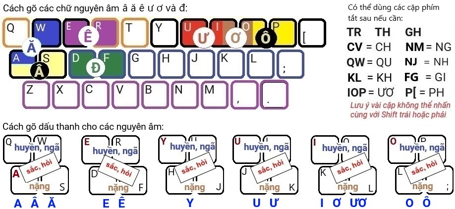

# Gõ tiếng Việt bằng K2K (Key Combination II)

Tổ hợp phím có nghĩa là **nhấn đồng thời** 2 hay nhiều phím, để xuất ra mỗi lần một chữ cái tiếng Việt có đầy đủ dấu *(không gõ tuần tự từng phím như các phương pháp khác)*
- Mỗi chữ cái **Â,Ă,Ê,Ư,Ơ,Ô,Đ** được gõ bằng cách **dùng 2 ngón tay** *(ngón trỏ và ngón giữa)* để nhấn như hình dưới.
- Nếu chữ cái có **dấu thanh** thì cùng lúc đó **dùng ngón khác** *(chọn tay nào thuận tiện)* nhấn thêm một phím bất kỳ ở hàng tương ứng với dấu cần gõ (như hình).

Phương pháp này cho phép gõ xen kẽ tiếng Việt và tiếng Anh rất tiện lợi.
# Hướng dẫn gõ trên bàn phím QWERTY:


# Minh họa cách nhúng VietK2K vào trang web:
Chương trình vietk2k.js dùng để tích hợp phương pháp gõ K2K vào các TextBox, TextArea trên trình duyệt web (đã test trên MS Edge).
```javascript
<script type="text/javascript" src="vietk2k.js"></script>
<script>
    var textArea = document.getElementById("userInput");
    var vKK = new VietK2K();
    vKK.attach(textArea);
</script>
```
Tham khảo file example.html

© 2024 **Lê Phước Lộc** *(phuocloc@gmail.com)*
